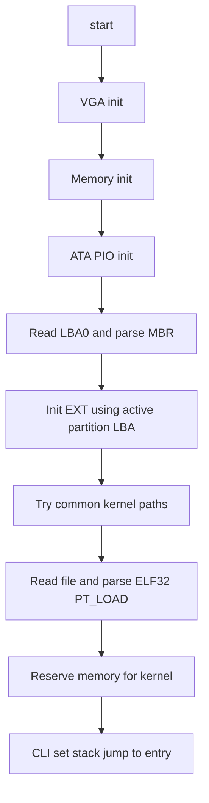

# RustyBoot

A single stage, freestanding x86 bootloader written in Rust. RustyBoot probes the disk MBR, initializes a minimalist EXT2 or EXT3 or EXT4 reader, loads an ELF32 kernel from common paths, and transfers control to the kernel entry point. It uses a tiny VGA text console and a minimal ATA PIO disk driver.

Part of the Rusty-Suite. Built for learning, experimentation, and low-level OS development.

---

## Features

- x86 32-bit freestanding environment, no_std, panic=abort
- Disk bring-up via ATA PIO LBA28 on primary master
- MBR read and parse with active partition selection
- EXT2 or EXT3 or EXT4 superblock detection with early boot constraints
- Minimal file read with direct, single indirect, and double indirect blocks
- ELF32 little endian loader for PT_LOAD segments
- Simple bump based memory manager 1 MB to 8 MB region with kernel reservation
- VGA text console output

## Status

- Implemented
  - ATA PIO disk identify and sector reads: [init()](src/drivers/disk.rs:116), [read_sectors()](src/drivers/disk.rs:165)
  - MBR parsing: [probe()](src/boot/mbr.rs:98), [debug_print()](src/boot/mbr.rs:137), [find_active_partition()](src/boot/mbr.rs:115)
  - EXT filesystem initialization and read constraints: [init_with_lba()](src/fs/ext.rs:134)
  - File read by absolute path: [read_file()](src/fs/ext.rs:529)
  - Kernel discovery and ELF loading: [find_and_load_kernel()](src/kernel/loader.rs:5), [parse_and_load_elf()](src/kernel/loader.rs:44), [jump_to_kernel()](src/kernel/loader.rs:153)
  - Memory initialization and reservation: [init()](src/memory/mod.rs:6), [find_kernel_address()](src/memory/mod.rs:57), [reserve_for_kernel()](src/memory/mod.rs:46)
- Planned or partial
  - FAT implementation: [init()](src/fs/fat.rs:1) stub
  - EXT extents and 64 bit features are not supported in early boot
  - Triple indirect blocks not implemented; max 1 MiB file buffer
  - Robust device discovery and error reporting

## Architecture



### Key entry points

- Entry point: [_start()](src/main.rs:14)
- Disk init and reads: [init()](src/drivers/disk.rs:116), [read_sectors()](src/drivers/disk.rs:165)
- MBR helpers: [probe()](src/boot/mbr.rs:98), [find_active_partition()](src/boot/mbr.rs:115), [debug_print()](src/boot/mbr.rs:137)
- EXT reader: [init_with_lba()](src/fs/ext.rs:134), [read_file()](src/fs/ext.rs:529)
- Kernel loader: [find_and_load_kernel()](src/kernel/loader.rs:5), [parse_and_load_elf()](src/kernel/loader.rs:44), [jump_to_kernel()](src/kernel/loader.rs:153)
- Memory: [init()](src/memory/mod.rs:6), [find_kernel_address()](src/memory/mod.rs:57), [reserve_for_kernel()](src/memory/mod.rs:46)
- Low level utils: [memcpy()](src/memory/mem.rs:2), [memset()](src/memory/mem.rs:14)

## Filesystem support

- EXT2 or EXT3 or EXT4 early boot reader
  - Validates magic 0xEF53 and basic features
  - Rejects extents and 64 bit incompat features for simplicity
  - Block size 1 KiB to 4 KiB, must be multiple of 512
  - Supports direct, single indirect, and double indirect blocks
  - Triple indirect not implemented
  - File size limit 1 MiB compile time buffer cap
  - Absolute path only, example: /boot/vmlinuz
- FAT
  - Not implemented yet; stub returns error

## Kernel loading

- Search paths in order: /boot/vmlinuz, /boot/kernel, /kernel, /boot/bzImage
- ELF32 little endian only
- Loads PT_LOAD segments to their specified virtual addresses
- Zero fills remaining memory when mem_size is greater than file_size
- Reserves the loaded memory region

## Build

### Requirements

- Rust toolchain with llvm tools preview
- ld.lld or lld available; build.rs passes -T bootloader.ld
- objcopy llvm objcopy or GNU objcopy
- qemu system i386
- make
- Linux host recommended; install deps uses zypper openSUSE example

### Quick start

```bash
rustup component add llvm-tools-preview
make bootloader
make disk
make run
```

### Notes

- Target spec: [i686-bootloader.json](i686-bootloader.json)
- build.rs emits a linker script mapping .text at 0x8000 and passes it as -Tbootloader.ld: [build.rs](build.rs)
- A separate [linker.ld](linker.ld) exists but is not used by the build script
- The generated disk.img contains only the boot sector; to load a real kernel, attach a drive containing an EXT filesystem with your kernel at one of the supported paths

## Configuration

- Target: i686-unknown-none, little endian, executables true, panic abort, code model kernel, disable red zone
- Linker script
  - Generated by [build.rs](build.rs) at build time

## Limitations and caveats

- 32 bit only; no long mode setup
- Static memory map; no E820 probing
- No filesystem journaling handling, no extents, no 64 bit EXT features
- ELF64 not supported
- Serial output is minimal; VGA is the primary console
- Single disk, primary master ATA PIO path assumed

## Contributing

See [CONTRIBUTING.md](CONTRIBUTING.md) and [CODE_OF_CONDUCT.md](CODE_OF_CONDUCT.md).

## Trademark notice

The names Rusty-Suite, RustyTodos, RustyBoot, and Rusty-Checker are part of this project identity. See [TRADEMARK.md](TRADEMARK.md).

## License

GPLv3. See [LICENSE](LICENSE).

Built with ❤️ in Rust.
