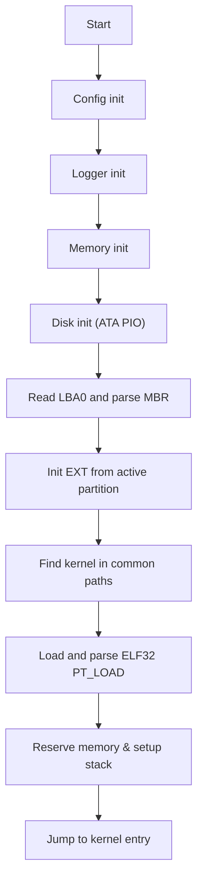

# RustyBoot

A single stage, freestanding x86 bootloader written in Rust.  
RustyBoot probes the disk MBR, initializes a minimalist EXT2/3/4 reader, loads an ELF32 kernel from common paths, and transfers control to the kernel entry point.  
It uses a tiny VGA text console and a minimal ATA PIO disk driver.  

Part of the Rusty-Suite. Built for learning, experimentation, and low-level OS development.  

---

## WIP

Working on: Porting RustyBoot to UEFI with EFI entry point and SimpleFileSystem kernel loading

---

## Features

- x86 32-bit freestanding environment, `no_std`, `panic=abort`
- Disk bring-up via ATA PIO LBA28 on primary master
- MBR read and parse with active partition selection
- EXT2/3/4 superblock detection with early boot constraints
- Minimal file read with direct, single indirect, and double indirect blocks
- ELF32 little endian loader for PT_LOAD segments
- Simple bump-based memory manager (1 MB – 8 MB region with kernel reservation)
- VGA text console output
- Modular Rust codebase with clear separation of:
  - **Config** (runtime options & parameters)
  - **Hammering** (low-level memory & disk probing logic)
  - **Logger** (diagnostics and debugging output)

---

## Status

- ✅ Implemented
  - ATA PIO disk identify and sector reads
  - MBR parsing and active partition discovery
  - EXT filesystem init and early boot reads
  - File reads by absolute path
  - Kernel discovery and ELF32 loading
  - Memory initialization and kernel memory reservation
- 🛠️ Planned or partial
  - FAT filesystem implementation (stub only)
  - EXT extents and 64-bit features not supported
  - Triple indirect blocks not implemented (1 MiB file buffer limit)
  - More robust device discovery and error reporting

---

## Architecture



## Key Entry Points

- **Entrypoint:** [`_start()`](src/main.rs)
- **Config:** [`Config::load()`](src/config.rs)
- **Logger:** [`init_logger()`](src/logger.rs)
- **Disk:** [`init()`](src/drivers/disk.rs), [`read_sectors()`](src/drivers/disk.rs)
- **MBR:** [`probe()`](src/boot/mbr.rs), [`find_active_partition()`](src/boot/mbr.rs)
- **EXT:** [`init_with_lba()`](src/fs/ext.rs), [`read_file()`](src/fs/ext.rs)
- **Kernel loader:** [`find_and_load_kernel()`](src/kernel/loader.rs), [`parse_and_load_elf()`](src/kernel/loader.rs), [`jump_to_kernel()`](src/kernel/loader.rs)
- **Memory:** [`init()`](src/memory/mod.rs), [`reserve_for_kernel()`](src/memory/mod.rs)

---

## Filesystem Support

- **EXT2/3/4 early boot reader**
  - Validates magic `0xEF53`
  - Rejects extents and 64-bit features for simplicity
  - Block size: 1–4 KiB (multiple of 512)
  - Supports direct, single indirect, and double indirect blocks
  - Triple indirect not implemented
  - File size limit: 1 MiB (compile-time buffer cap)
  - Absolute path only (example: `/boot/vmlinuz`)
- **FAT**
  - Stub only (not yet implemented)

---

## Kernel Loading

- Search paths: `/boot/vmlinuz`, `/boot/kernel`, `/kernel`, `/boot/bzImage`
- ELF32 little endian only
- Loads PT_LOAD segments to specified virtual addresses
- Zero-fills memory when `mem_size > file_size`
- Reserves the loaded region

---

## Build

### Requirements

- Rust toolchain with `llvm-tools-preview`
- `ld.lld` or `lld`
- `objcopy` (LLVM or GNU)
- `qemu-system-i386`
- `make`
- Linux host recommended (example: `zypper` on openSUSE)

### Quick Start

```bash
rustup component add llvm-tools-preview
make bootloader
make disk
make run
```

## Configuration

- **Target:** `i686-unknown-none`
- **Executables:** true
- **Endianness:** little
- **Panic strategy:** abort
- **Code model:** kernel
- **Red zone:** disabled
- **Linker script:** generated at build time via [build.rs](build.rs)

---

## Limitations & Caveats

- 32-bit only; no long mode
- Static memory map (no E820 probing)
- No filesystem journaling, extents, or 64-bit EXT features
- ELF64 unsupported
- Serial output minimal (VGA primary console)
- Single disk, primary master ATA PIO assumed

---

## Contributing

See [CONTRIBUTING.md](CONTRIBUTING.md) and [CODE_OF_CONDUCT.md](CODE_OF_CONDUCT.md).

---

## Trademark Notice

The names **Rusty-Suite**, **RustyTodos**, **RustyBoot**, and **Rusty-Checker**  
are part of this project identity. See [TRADEMARK.md](TRADEMARK.md).

---

## License

GPLv3. See [LICENSE](LICENSE).  

Built with ❤️ in Rust.
